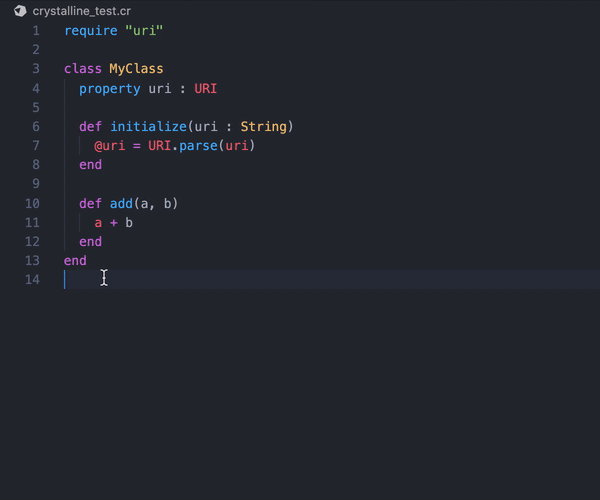
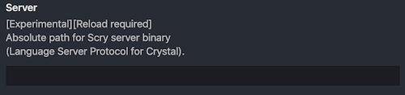

<div align="center">
	
	<h1>crystalline</h1>
  <h3>A Language Server for Crystal.</h3>
  <a href="https://github.com/elbywan/crystalline/actions?query=branch%3Amaster+workflow%3ABuild"></a>
  <a href="https://github.com/elbywan/crystalline/tags"></a>
  <a href="https://github.com/elbywan/crystalline/blob/master/LICENSE"></a>
</div>

<hr/>

**`Crystalline` is an implementation of the [Language Server Protocol](https://microsoft.github.io/language-server-protocol/) written in and for the [Crystal Language](https://crystal-lang.org/). It aims to provide limited language features (like go-to, autocompletion, syntax and semantic checking) and ease development with any compatible code editor.**

**Status: in development.**

<hr/>

<div align="center">

</div>

## Installation

*Recommended method is to download and use pre-built binaries when possible. Building from source does take a long time.*

### Pre-built binaries

#### Latest Release

##### Linux (x86_64)

```sh
wget https://github.com/elbywan/crystalline/releases/latest/download/crystalline_x86_64-unknown-linux-gnu.gz -O crystalline.gz &&\
gzip -d crystalline.gz &&\
chmod u+x crystalline
```

###### ArchLinux

```sh
yay -S crystalline
```

##### MacOS (x86_64)

```sh
curl -L https://github.com/elbywan/crystalline/releases/latest/download/crystalline_x86_64-apple-darwin.gz -o crystalline.gz &&\
gzip -d crystalline.gz &&\
chmod u+x crystalline
```

#### Specific commit

[Binaries are uploaded as artifacts during the CI build.](https://github.com/elbywan/crystalline/actions)

### Build from source

**Warning: this can take a long time! (several minutes - up to 20 minutes, depending on your hardware)**

#### Scoped install

In the `.shard.yml` file:

```yml
development_dependencies:
  crystalline:
    github: elbywan/crystalline
    branch: main
```

Then:

```sh
# Produces a binary at ./bin/crystalline
shards build crystalline --release --no-debug --progress -Dpreview_mt
```

#### Global install

```sh
git clone https://github.com/elbywan/crystalline
cd crystalline
mkdir bin
crystal build ./src/crystalline.cr  -o ./bin/crystalline --release --no-debug --progress  -Dpreview_mt
```

#### Known Build Issues

*Potential errors when building from source.*

<details><summary><strong>llvm-config path</strong></summary>
<p>

`llvm` is required in order to build `crystalline`, if you get the following error message it means that the crystal compiler is unable to locate the `llvm-config` binary:

```sh
--: : command not found
Showing last frame. Use --error-trace for full trace.

In /usr/local/Cellar/crystal/0.35.1/src/llvm/lib_llvm.cr:13:17

 13 | VERSION = {{`#{LibLLVM::LLVM_CONFIG} --version`.chomp.stringify}}
                  ^
Error: error executing command: "" --version, got exit status 127
```

This can be solved by adding the location of the `llvm-config` binary to the `LLVM_CONFIG` environment variable. (or the containing directory to the `PATH` env. variable)

For instance on a typical macOS setup, prefixing the command with the following declaration would solve the issue:

```sh
# Prepend the command with this:
env LLVM_CONFIG=/usr/local/opt/llvm/bin/llvm-config
# For Example:
env LLVM_CONFIG=/usr/local/opt/llvm/bin/llvm-config crystal build ./src/crystalline.cr  -o ./bin/crystalline --release --no-debug -Dpreview_mt
```
> Replace `env` by `export` on Debian and derived (Ubuntu, Mint, ...)

</p>
</details>

<details><summary><strong>ld: library not found for -llibxml2.tbd</strong></summary>
<p>

LLVM **10.0.1** has some issues when reporting required system libraries on macOS.

More info: [here](https://github.com/ziglang/zig/issues/6087)

```sh
# Wrong: -llibxml2.tbd
$ llvm-config --system-libs
-lm -lz -lcurses -llibxml2.tbd
# `liblibxml2.tbd.dylib` is unlikely to be found during compilation,
# hence the "library not found" error…
```

A hacky solution until llvm produces a solution would be to add a symbolic link to the correct shared library file:

`ln -s /usr/lib/libxml2.2.dylib /usr/local/lib/liblibxml2.tbd.dylib`

Or just use a different LLVM major version until this issue is fixed upstream.

</p>
</details>

## Usage

`Crystalline` is meant to be used alongside an editor extension.

#### VSCode

- Add the [Crystal Language extension](https://marketplace.visualstudio.com/items?itemName=crystal-lang-tools.crystal-lang).

- In the configuration, type the **absolute** location of the binary in the following field:



- Reload the window by pressing CMD/CTRL + SHIFT + P and select `Developer: Reload Window` (or as an alternative, restart VSCode).

### Entry point

**Important:** Crystalline will try to determine which file is best suited as an entry point when providing language features.

The default behaviour is to check the `shards.yml` file for a `target` entry with the same name as the shard.

```yml
name: my_shard

targets:
  my_shard:
    main: src/entry.cr
```

With the configuration above, every file required by `src/entry.cr` will use `src/entry.cr` as the entry point.

If this `shard.yml` entry is not present, or if the file is not part of the main dependency tree then `crystalline` will use the file itself as the entry point.

**To override this behaviour**, you can add a configuration key in the `shard.yml` file.

```yml
crystalline:
  main: .crystalline_main.cr
```

This can be extremely important to understand when you are writing a code library that does not call any of its own methods - it will skip code analysis. In this case, and if you are writing `specs`, you should point to a file that require the specs (or anything calling the library) and then `crystalline` will use it as the entry point.

```crystal
# Contents of a file at the root of the project.
# Will require the specs that call the library methods and enable the code analysis.
require "./spec/**"
```

## Features

**Disclaimer: `Crystalline` is not as extensive in terms of features as other Language Servers but still provides very convenient tools.**

#### Code Diagnostics

Syntax and semantic checks on save.

#### Limited Autocompletion

List (depending on the target) method definitions, macros or module/class/struct names or symbols available in the current context.

#### Formatting

A whole document or a text selection.

#### Go to definition

By clicking on a symbol with the Cmd or Ctrl key pressed (editor/platform dependent).

#### Hover information

Hovering should display (when possible) either a variable type, a function definition signature or the expanded macro.

#### Document symbols

Fetch all the symbols in a given file, used in VSCode to populate the Outline view and the Breadcrumbs.

## Limitations

- Due to Crystal having a wide type inference system (which is incredibly convenient and practical), compilation times can unfortunately be relatively long for big projects and depending on the hardware. This means that the LSP will be stuck waiting for the compiler to finish before being able to provide a response.
Crystalline tries to mitigate that by caching compilation outcome when possible.

- Methods that are not called anywhere will not be analyzed, as this is how the Crystal compiler works.

- The parser is not permissive, nor incremental which means that the features will sometimes not work. It would involve a massive amount of work to change that.

## Development

###  Dev build

[Sentry](https://github.com/samueleaton/sentry) is used to re-build crystalline in debug mode on code change.

```sh
# To build sentry (once):
shards build --release sentry
# Then, to launch it and watch the filesystem:
./bin/sentry -i
```

### Logs

Logging is the most practical way to debug the LSP.

```crystal
# Use the LSP logger to display logs in the editor.
LSP::Log.info { "log" }
```
Debug logs are deactivated by default, uncomment this line in `src/crystalline/lsp/server.cr` to enable them:

```crystal
# Uncomment:
# ::Log.setup(:debug, LSP::Log.backend.not_nil!)
```

## Contributing

1. Fork it (<https://github.com/elbywan/crystalline/fork>)
2. Create your feature branch (`git checkout -b my-new-feature`)
3. Commit your changes (`git commit -am 'Add some feature'`)
4. Push to the branch (`git push origin my-new-feature`)
5. Create a new Pull Request

**Please always `crystal tool format` your code!**

## Contributors

- [elbywan](https://github.com/elbywan) - creator and maintainer

## Credit

- [Scry](https://github.com/crystal-lang-tools/scry), the original LSP for Crystal has been a great source of inspiration. I also re-used tiny bits of code from there.
- Icon made by [Smashicons](https://www.flaticon.com/authors/smashicons) from [www.flaticon.com](https://www.flaticon.com).

## Trivia

#### Why the name `crystalline`?

Aside of the obvious reasons (crystal-lang), `cristaline` is a famous bottled water brand in France that published silly TV commercials.
It is pronounced the same as `crystalline`.


